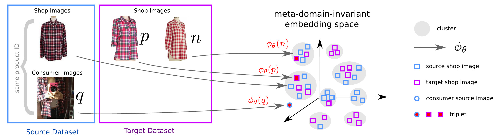

# Unsupervised Meta-Domain Adaptation for Fashion Retrieval (UDMA)

PyTorch implementation to learn a domain invariant representation for cross-domain fashion item retrieval, for example:


### Prerequisites
- Tested on Linux: Ubuntu 16.04.1, and CUDA-9.0

### Getting Started
```bash
mkdir UDMA_Codebase && cd UDMA_Codebase
```
- Clone this repo:
```bash
git clone https://github.com/almazan/deep-image-retrieval.git
cd deep-image-retrieval/dirtorch
mkdir data && cd data
```
- Download the pre-trained model: [Resnet101-TL-GeM model](https://drive.google.com/open?id=1vhm1GYvn8T3-1C4SPjPNJOuTU9UxKAG6) available from [Deep Image Retrieval](https://github.com/almazan/deep-image-retrieval) and save it in the `data` folder.
```bash
wget https://cvhci.anthropomatik.kit.edu/~vsharma/UDMA/dirtorch_model/Resnet101-TL-GeM.pt
```
- setup vitual environment
```bash
cd ../..
python3 -m venv venv
source venv/bin/activate
```
- Install packages
```bash
pip install torch==1.3.1 torchvision==0.4.2
pip install pytorch-metric-learning==0.9.65
pip install pandas==0.25.3
pip install h5py==2.10.0 matplotlib==3.1.2
pip install opencv-python==4.1.2.30
```
- Clone the `UDMA` repo in `deep-image-retrieval`
```bash
>> PYTHONPATH=$PYTHONPATH:$PWD
>> git clone https://github.com/vivoutlaw/UDMA.git
>> cd UDMA
```

## Datasets
Download the pre-extracted features for both `DeepFashion` and `Street2Shop` datasets using the following script. The feature were extracted using our pre-trained model on DeepFashion. Trainset (`ClusteringFeats`) and Testset (`Street2Shop` | `DeepFashion`)
```bash
bash ./features/download_dataset.sh Street2Shop
bash ./features/download_dataset.sh DeepFashion
bash ./features/download_dataset.sh ClusteringFeats
```

## UDMA-MLP: Pre-trained model evaluation
- `Feature extraction using pre-trained UDMA-MLP model`: 
```bash
>> CUDA_VISIBLE_DEVICES=0 python test_mlp.py  --WS=WS5 --model-name=DeepFashion --comb=L12 --optimizer=ADAM --eval-dataset=Street2Shop --load-epoch=45000 --batch-size=2000 --resume --finch-part=0
```
- `Quantitative Results: DF-BL, UDMA-MLP`: 
```bash
>> cd evaluation_scripts
>> eval_final_s2s_retrieval('Street2Shop', 'DeepFashion_ADAM_ALL', 60, 'X', 'regular') % DF-BL
mAP = 0.2283, r1 precision = 0.3298,  r5 precision = 0.4470,  r10 precision = 0.4883, r20 precision = 0.5355, r50 precision = 0.5921
>> eval_final_mlp_s2s_retrieval('Street2Shop', 'DeepFashion_ADAM_ALL', 60 , 'X', 'regular', 'L12_0_WS5', 45000) % UDMA-MLP
mAP = 0.2430, r1 precision = 0.3592,  r5 precision = 0.4761,  r10 precision = 0.5241, r20 precision = 0.5644, r50 precision = 0.6210
```

## UDMA-MLP: Finetuning MLP with pretrained DF-BL model weights
- `Weighting strategy used for MLP training`:
```bash
>> python -W ignore weighting_strategy_part1.py --finch-part=0
>> python -W ignore weighting_strategy_part1.py --finch-part=0
>> python -W ignore weighting_strategy_part2.py --comb=L12 --optimizer=ADAM --finch-part=0 
```
-  Download the pre-trained model trained on DeepFashion (`trainval set`) using Resnet101-TL-GeM model.
```bash
bash ./models/download_our_DF_model.sh DeepFashion
```
- `Script for UDMA-MLP training`:
```bash
>> CUDA_VISIBLE_DEVICES=0 python -W ignore train_mlp.py  --WS=WS5 --dataset=DeepFashion --comb=L12 --optimizer=ADAM  --num-threads=8 --batch-size=128 --lr=1e-4 --resume-df --load-epoch-df=60 --epochs=45000 --finch-part=0 --batch-category-size=12 
```
## Finetuning Full [Resnet101-TL-GeM model](https://drive.google.com/open?id=1vhm1GYvn8T3-1C4SPjPNJOuTU9UxKAG6) on DeepFashion dataset
In our work, we use both `train` and `val` set of DeepFashion for model train, and tested on `test` set. 
- Change `train_test_type` from `trainval`  to `train` for training the model only on `train` set.
- `Quantitative Results: DF test set`: 
```bash
>> cd evaluation_scripts
>> eval_df_retrieval('DeepFashion', 'DeepFashion_ADAM_ALL', 60, 'X', 'regular') % DF test set
mAP = 0.3075, r1 precision = 0.3107,  r5 precision = 0.5209,  r10 precision = 0.5994, r20 precision = 0.6712,  r50 precision = 0.7603
```
- `Script for training the full-model`:
```bash
>> CUDA_VISIBLE_DEVICES=0,1,2,3 python main_train_df.py --dataset=DeepFashion --df-comb=ALL --optimizer=ADAM --num-threads=8 --batch-size=128 --lr=1e-4 --epochs=60 --checkpoint=../dirtorch/data/Resnet101-TL-GeM.pt
```
- After the model is trained, we use the last `fc` layer of this model for `UDMA-MLP`.
- Optional. `Script for feature extraction`: Download [DeepFashion](http://mmlab.ie.cuhk.edu.hk/projects/DeepFashion/Consumer2ShopRetrieval.html) and [Street2Shop](http://www.tamaraberg.com/street2shop/) datasets. For bounding boxes of `Street2Shop`, please contact Naila Murray (at naila.murray@naverlabs.com). Also modify `path_to_images_` with correct path to images.
```bash
# Train Set (fc feats) ############### DeepFashion evaluation and Street2Shop Features. 
CUDA_VISIBLE_DEVICES=0 python main_extract_train_feats.py --model-name=DeepFashion --df-comb=ALL --optimizer=ADAM --eval-dataset=DeepFashion --load-epoch=60 --batch-size=256 --resume --layer=X
CUDA_VISIBLE_DEVICES=0 python main_extract_train_feats.py --model-name=DeepFashion --df-comb=ALL --optimizer=ADAM --eval-dataset=Street2Shop --load-epoch=60 --batch-size=256 --resume --layer=X

# Train Set (GEM normalized feats) -- Commment lines after "x.squeeze_()" in dirtorch/nets/rmac_resnext.py
CUDA_VISIBLE_DEVICES=0 python main_extract_train_feats.py --model-name=DeepFashion --df-comb=ALL --optimizer=ADAM --eval-dataset=DeepFashion --load-epoch=60 --batch-size=256 --resume --layer=X-1
CUDA_VISIBLE_DEVICES=0 python main_extract_train_feats.py --model-name=DeepFashion --df-comb=ALL --optimizer=ADAM --eval-dataset=Street2Shop --load-epoch=60 --batch-size=256 --resume --layer=X-1

# Test Set (fc feats) ############### DeepFashion evaluation and Street2Shop Features. 
CUDA_VISIBLE_DEVICES=0 python main_extract_test_feats.py --model-name=DeepFashion --df-comb=ALL --optimizer=ADAM --eval-dataset=DeepFashion --load-epoch=60 --batch-size=256 --resume  --layer=X
CUDA_VISIBLE_DEVICES=0 python main_extract_test_feats.py --model-name=DeepFashion --df-comb=ALL --optimizer=ADAM --eval-dataset=Street2Shop --load-epoch=60 --batch-size=256 --resume  --layer=X

# Test Set (GEM normalized feats) -- Commment lines after "x.squeeze_()" in dirtorch/nets/rmac_resnext.py
CUDA_VISIBLE_DEVICES=0 python main_extract_test_feats.py --model-name=DeepFashion --df-comb=ALL --optimizer=ADAM --eval-dataset=DeepFashion --load-epoch=60 --batch-size=256 --resume --layer=X-1
CUDA_VISIBLE_DEVICES=0 python main_extract_test_feats.py --model-name=DeepFashion --df-comb=ALL --optimizer=ADAM --eval-dataset=Street2Shop --load-epoch=60 --batch-size=256 --resume --layer=X-1
```


## Citations
If you find the code and datasets useful in your research, please cite:
```    
@inproceedings{udma,
     author    = {Vivek Sharma, Gabriela Csurka, Naila Murray, Diane Larlus, M. Saquib Sarfraz, and Rainer Stiefelhagen}, 
     title     = {Unsupervised Meta-Domain Adaptation for Fashion Retrieval}, 
     booktitle = {Preprint},
     year      = {2020}
}

@inproceedings{finch,
    author    = {M. Saquib Sarfraz, Vivek Sharma and Rainer Stiefelhagen}, 
    title     = {Efficient Parameter-free Clustering Using First Neighbor Relations}, 
    booktitle = {Proceedings of the IEEE Conference on Computer Vision and Pattern Recognition (CVPR)},
    year  = {2019}
}

@inproceedings{kucer,
  title={A detect-then-retrieve model for multi-domain fashion item retrieval},
  author={Kucer, Michal and Murray, Naila},
  booktitle={Proceedings of the IEEE Conference on Computer Vision and Pattern Recognition Workshops},
  year={2019}
}

```
